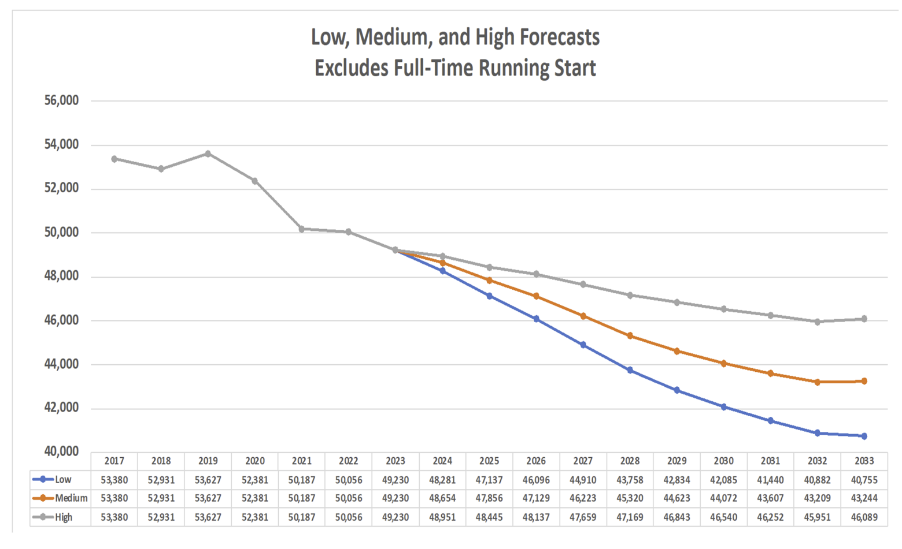
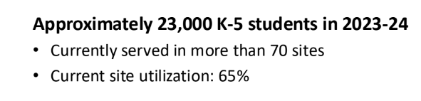

Notes on data relating to SPS elementary school closures
================
Bryan Shalloway
2024-10-09

Seattle Public Schools (SPS) gave a well resourced school update on June
26th 2024 where they recommended investigating a plan for elementary
school closures. As part of the explanation for that plan they pointed
at falling enrollment numbers and low capacity percentages for
elementary schools. The powerpoint from that June 2024 meeting can be
found
[here](https://www.documentcloud.org/documents/24784284-sps-wrs-update-6_26_24-final-copy-1?responsive=1&title=1).
A few notes on those points:

- Enrollment numbers for 2024-2025 appear not to have dropped as much as
  was forecasted in that meeting earlier in the year.
- There may be some open questions regarding the way percent capacity
  utilization is calculated

# Did enrollment actually drop in 2024-2025 school year?

SPS had contracted Educational Data Solutions, LLC to forecast
enrollment numbers (notes from that effort found
[here](https://www.seattleschools.org/wp-content/uploads/2024/06/Seattle_Enrollment-Demogr-trends_March_2024_ada.pdf)).
At the June public meeting SPS displayed this chart of enrollment
forecasts:

<!-- -->

If you take the difference in 2023 actual enrollment, you can see for
2024-2025 school year they were projecting a loss of 576 students with a
range of 279 to 949 less students in 2024-2025.

2024-2025 just started, so we can check these forecasts against the
September monthly enrollment numbers. If we compare this to the
September 2023 vs September 2024 enrollment numbers the actual number of
students that dropped was only around 27 if looking at total students or
161 if looking at the September point-in-time count. Kindergarten
enrollments actually rose year over year (but this wasn’t enough to
offset the loss of the comparatively larger graduating class). The
Kindergarten class also isn’t yet up to the class size of 2022. However
it is notable that enrollment numbers (even just one year ahead of
forecasts) already exceeded even the most pessimistic figures being
communicated by SPS during planning.

The numbers I reference are based on the September monthly enrollment
P223 reports that can be found for
[sep-2023](https://www.seattleschools.org/wp-content/uploads/2023/09/P223_Sep23.pdf)
and
[sep-2024](https://www.seattleschools.org/wp-content/uploads/2024/09/P223_Sep24.pdf).
The forecasts may be of slightly different student count figures
(e.g. different times of year or different ways of tabulating counts).
However this likely doesn’t change the takeaway that enrollment dropped
less than expected because for comparisons of *changes* in student
enrollment, p223 based year-over-year September enrollment changes have
historically offered a decent comparative proxy to what shows-up on
official end-of-year numbers (especially as a comparative measure about
year over year change). For example the drop from [September
2022](https://www.seattleschools.org/wp-content/uploads/2022/09/P223_Sep22.pdf)
to September 2023 was much much larger than this year’s drop.

It’s also worth noting also that SPS contracted another firm, Flo
Analytics, as a second firm to do forecasting
([report](https://www.seattleschools.org/wp-content/uploads/2024/07/Seattle-PS-2024-25-to-2033-34-enrollment-forecast-document.pdf)).
They forecasted a drop of 552 students with a range of 27 to 976
students. The actual drop may fall within the range of Flo Analytics’
forecasts. (However these forecasts were not shared in public meetings
or presentations during the time when SPS was announcing their initial
school closure plans.)

# Notes on % capacity utilization

One other explanation for the need to close schools was the low capacity
rates of elementary schools. Slide 33 in the June presentation points to
elementary schools being at only 65% capacity.

<!-- -->

The capacity rates by school are included in the Appendix of the June
2024 presentation. A copy of these tables can be found from a “Sazan
Envrionmental Services Facility Assessment Report” from January 2022
[here](https://www.seattleschools.org/wp-content/uploads/2024/09/sazan-scores-capacity.pdf).
Other reports by Sazan are concerned with Building Condition, Learning
Environment, and Accessibility Evaluation (see SPS’ website
[here](https://www.seattleschools.org/departments/capital-projects-and-planning/facilities-master-plan/#gd71995336887)).
However the Master Plan document found on SPS [Building
Conditions](https://www.seattleschools.org/departments/capital-projects-and-planning/facilities-master-plan/#gd71995336887)
page
[here](https://www.seattleschools.org/wp-content/uploads/2021/09/2021_Facilities_Master_Plan_Update.pdf)
publishes different capacity numbers than those in the Sazan document
that was presented in June of 2024. These capacity numbers are quite
different and may not be directly comparable between schools for the
following reasons:

- The Master plan doc looks like it includes both Pre-K and K-5 whereas
  the Sazan doc is only for K-5 kids in those schools
- Relatedly the Master Plan doc separates out K-8 schools to a different
  group whereas the Sazan doc references capacity just for K-5
  (presumably) for K-8 schools
- The Master plan doc capacity numbers are explicitly based on permanent
  structures and do not take into account temporary structures like
  portables. The Sazan doc does not specify whether the capacity numbers
  are based on permanent or permanent and temporary structures

Hence to get a list of schools where these docs’ different “capacity
numbers” could be compared I filtered to just schools that did not have
Pre-K and did not have any temporary structures and that were not K-8
and did not have any issues loading data. This left me with just 13
schools to compare (and again, I might just be missing something here
and these may not be appropriate comparisons for some reason). See
bottom of doc.

Taking a weighted average across these 13 schools the capacity numbers
were \~11% higher in the Sazan doc (/June 2024 presentation) compared to
what is shown on the Master Plan doc. If this ratio is applied across
schools, the 11% higher capacity equates to \~7 percentage point lower
utilization. I.e. using the Master Doc rather than the Sazan doc (that
was presented in June 2024) would mean 72% capacity utilization of
elementary schools vs 65%.

Again, *it could be the case* that there are good reasons SPS used the
Sazan doc rather than the Master plan doc for capacity or that there is
something that I missed or some gap in logic in my notes above that I
am. **THESE ARE JUST A FEW INITIAL NOTES THAT NEED TO BE INVESTIGATED
MORE CAREFULLY**

Below are the code and calculations to get the two different total
capacity numbers across the 13 comparable schools.

    ## [1] "individual school capacity numbers"

| common_name               | capacity_master | capacity_sazan |
|:--------------------------|----------------:|---------------:|
| bagley                    |             503 |            503 |
| beacon hill international |             360 |            398 |
| bryant main               |             462 |            532 |
| decatur                   |             286 |            236 |
| genesee hill              |             594 |            650 |
| hawthorne                 |             340 |            480 |
| john stanford             |             418 |            398 |
| lawton                    |             396 |            480 |
| leschi                    |             340 |            532 |
| loyal heights             |             572 |            650 |
| mcgilvra                  |             264 |            166 |
| queen anne                |             500 |            500 |
| stevens                   |             264 |            373 |

    ## [1] "aggregated capacity numbers across comparable 13 schools"

| capacity_master | capacity_sazan |   n |
|----------------:|---------------:|----:|
|            5299 |           5898 |  13 |

- “11% lower capacity in Master compared to Sazan doc” comes from
  (5898 - 5299) / 5898
- “72% capacity utilization vs 65% if applying this across all schools”
  comes from (5898 \* 0.65) / 5299
